# Deploy Wayshub (Task Day 1 & 2)  
Pada tugas ini saya melakukan deploy aplikasi Wayshub dengan backend dan frontend berjalan pada satu server.  
---

## Step 1. Menyiapkan Sistem  
Update paket, install tool dasar, Node.js LTS (via nvm), dan PM2.  

### Update paket 
`sudo apt update` 

### Download dan install dari web browser Node.js LTS nya
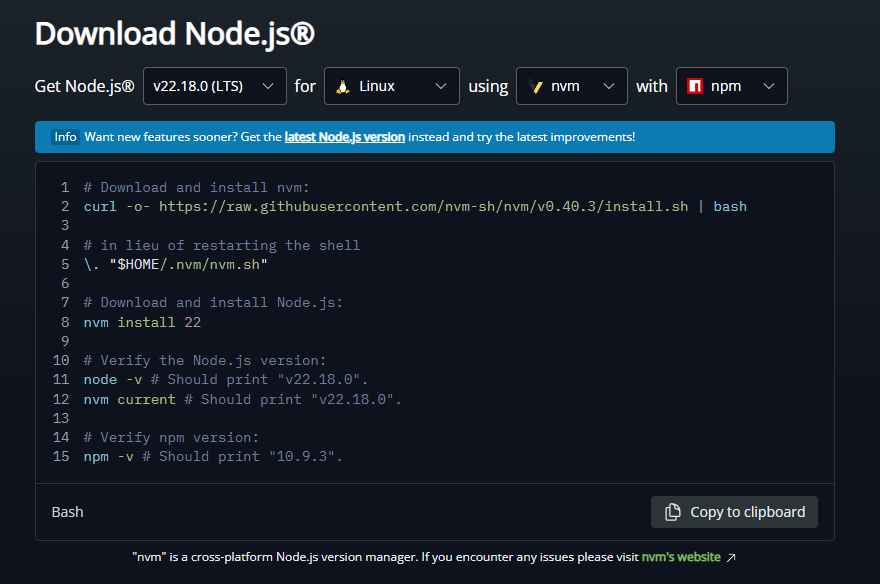  

### Memilih versi node dan mengecek versinya
`nvm install 12`  
`nvm use 12`  
`node -v dan npm -v`  

### Install PM2
`npm i -g pm2`  

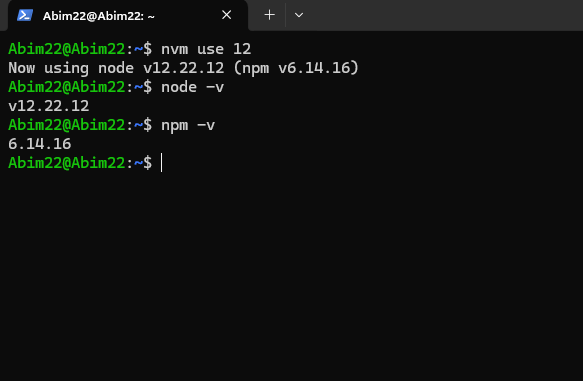  

---

## Step 2. Meng-clone Repository  
Saya meletakkan project di `~/dumbways-app`.  
```bash
mkdir -p ~/dumbways-app

git clone https://github.com/dumbwaysdev/wayshub-backend

git clone https://github.com/dumbwaysdev/wayshub-frontend
```
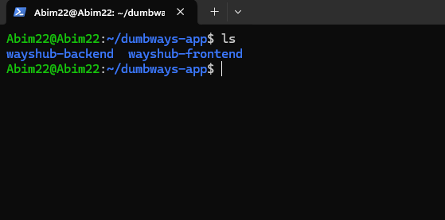  

---

## Step 3. Database (MySQL)
Saya menggunakan MySQL untuk database.
### Install dan menjalankan MySQL
`sudo apt install mysql-server`  
`sudo mysql`

### Mengatur password dan autentikasi user root di MySQL
`sudo mysql_secure_installation` yang isinya
```bash
1. Set root password → kalau belum ada password untuk user root, bisa diatur di sini.

2. Remove anonymous users → menghapus user anonim (tanpa nama) supaya orang asing nggak bisa akses Database.

3. Disallow root login remotely → menonaktifkan akses root dari luar server, biar root hanya bisa login dari localhost.

4. Remove test database → menghapus database “test” default bawaan MySQL yang bisa diakses siapa aja.

5. Reload privilege tables → menerapkan semua perubahan pengaturan keamanan tadi.
```
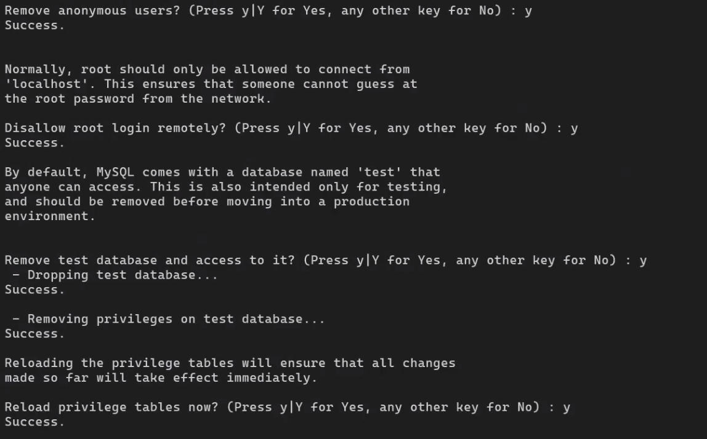  

lalu jalankan `sudo mysql` lagi dan masukan command  
`ALTER USER 'root'@'localhost' IDENTIFIED WITH caching_sha2_password BY 'dumbways';`  
yang artinya untuk mengubah metode login user root agar pakai password.
```bash
1. ALTER USER → perintah untuk merubah/mengedit akun user di MySQL.

2. caching_sha2_password → plugin autentikasi default dari MySQL 8.

3. 'dumbways' → password yang saya gunakan untuk root.
```
`CREATE USER 'abim'@'%' IDENTIFIED BY 'dumbways';`  
yang artinya membuat user 'abim' yang nantinya bisa diakes manasaja menggunakan passowrd dumbways.  
`GRANT ALL PRIVIVEGES ON *.* TO 'abim'@'%';`  
artinya memberikan akses kesemua database dan table.  

### Masuk MySQL menggunakan user dan password.
`sudo mysql -u abim -p`  
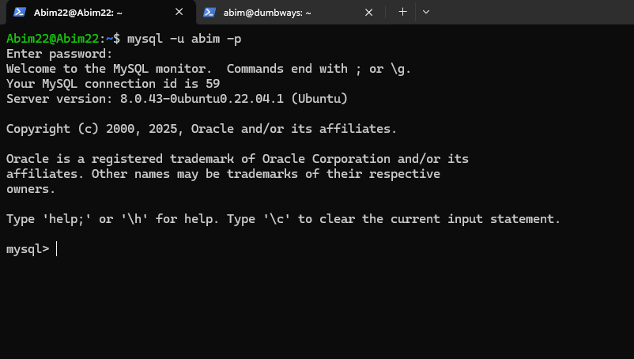  
### Membuat Database
```bash
# Masuk ke MySQL, dan buat database wayshub menggunakan command
CREATE DATABASE wayshub;

# Menampilkan semua database menggunakan  
SHOW DATABASES;

# Memilih database yang mau dipakai
USE wayshub;

# Melihat Table
SHOW TABLES;

# Menghapus database
DROP DATABASE wayshub;

# Menerapkan perubahan
FLUSH PRIVILEGES;
```
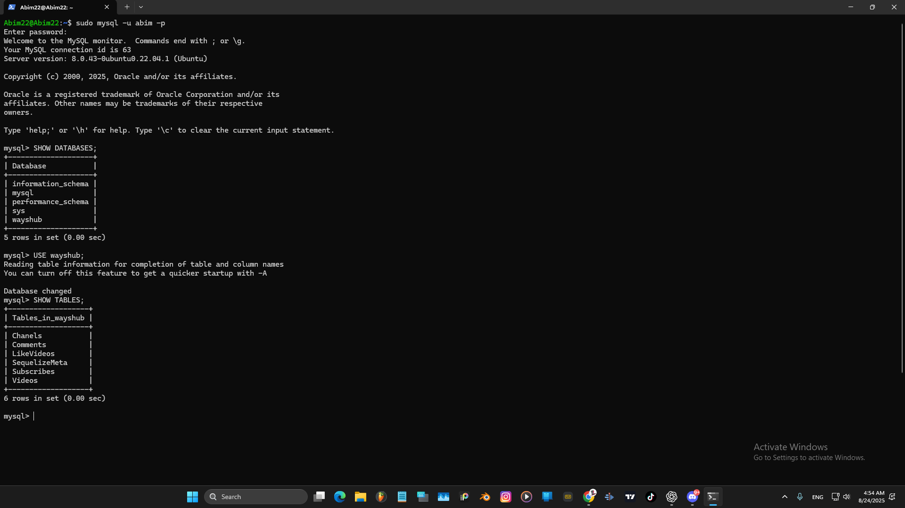  

---

## Step 4. Konfigurasi Backend (Sequelize)  
Masuk ke folder backend buka file package.json untuk mengatur dibagian development dan atur username dan password.  
`~/dumbways-app/wayshub-backend/config$ nano config.json`  
  
### Menjalankan sequelize
```bash
# pastikan menggunakan versi node yang sama dengan websitenya
nvm use 12

# jalankan sequelize
sequelize

# install sequelize-cli
npm i -g sequelize-cli
```
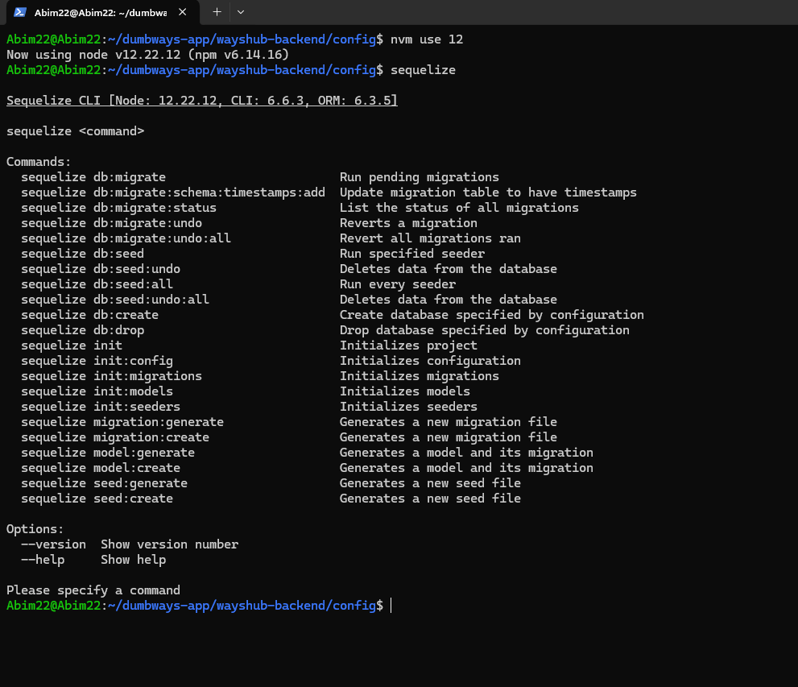 
```bash
# sequelize db:create
Membuat database kosong sesuai nama yang sudah ditulis di .env atau config/config.json (contoh: wayshub).
Jadi nggak perlu bikin database manual di MySQL pakai CREATE DATABASE.

# sequelize db:migrate
Menjalankan semua file migration yang ada di folder migrations/.
Migration berisi definisi tabel (misal tabel users, videos, comments) beserta kolom dan tipe datanya.
membuat struktur tabel di dalam database.
```
---

## Step 5. Konfigurasi Frontend (Build)  
Masuk ke folder frontend, install dependency, dan atur baseURL API agar melalui Nginx path `/api`.  
```bash
# Install dependency
npm install

# Membuka file Api.js 
~/dumbways-app/wayshub-frontend/src/config$ nano Api.js
untuk mengatur alamat server backend, contoh :
1. http://localhost:5000/api/v1
2. http://api.mentor.studentdumbways.my.id/api/v1
```
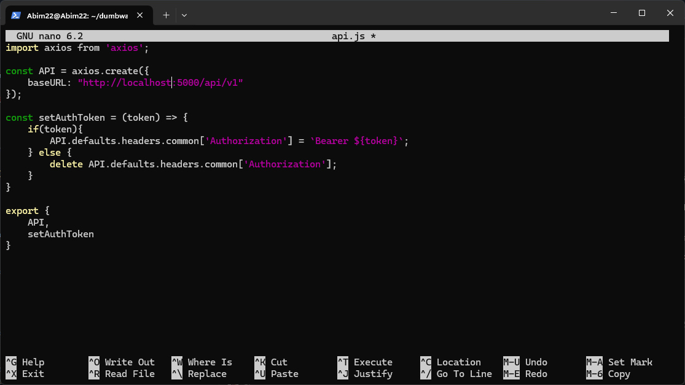  

---

## Step 6. Nginx 
Install dan konfigurasi Nginx 

Aktifkan Nginx:  
```bash
# Menjalankan Nginx
sudo systemctl start nginx

# Menjalankan atau membuat configurasi tertentu
-s /etc/nginx/sites-enabled$ sudo nano wayshub.conf
disini kitaa bisa mengatur contoh: 
- Reverse Proxy, contoh mengatur request /api untuk diarahkan ke backend
- Menambahkan domain
- Load Balancing, kalau ada beberapa backend

# Tapi disini saya tidak membuat atau merubah configurasi apapun yang ada di nginx, hanya sekedar menjalankan nginx saja 

# mengecek configurasi apakah benar
sudo nginx -t

# restart nginx kalau ada perubahan
sudo systemctl reload nginx
```
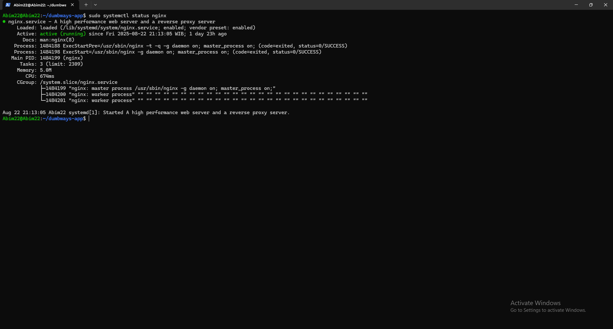  

---

## Step 7. Menjalankan PM2  
Saya menggunakan PM2 untuk menjaga program tetap berjalan di background.  
```bash
# Jalankan Backend
cd wayshub-Backend
pm2 start index.js --name wayshub-backend

# Jalankan Frontend
cd wayshub-frontend
pm2 start "npm start" --name wayshub-frontend

# Cek semua proses
pm2 ls

# Cek prosesnya normal atau error
pm2 logs
```
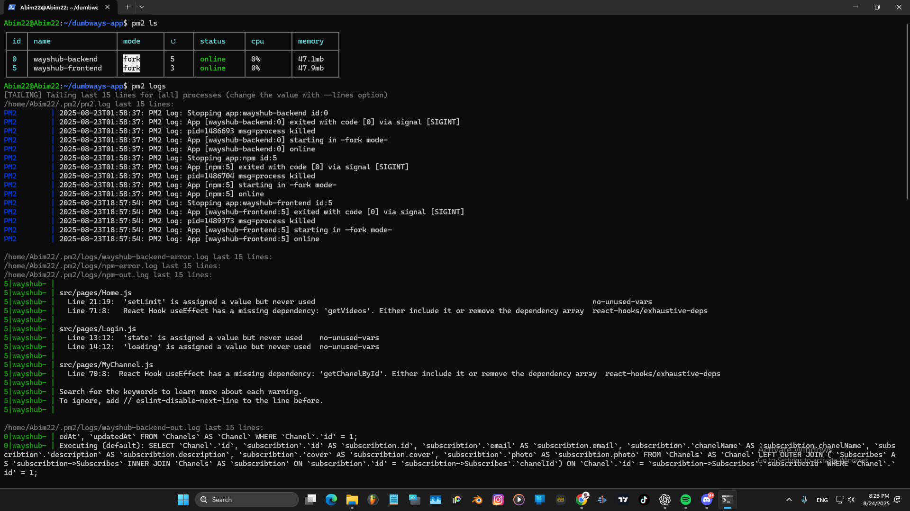   

---

## Step 8. Firewall (UFW)  
Saya membuka port yang diperlukan (SSH dan HTTP).  
```bash
sudo ufw allow 22
sudo ufw allow 80
sudo ufw allow 3000
sudo ufw allow 5000
sudo ufw enable
sudo ufw status
```
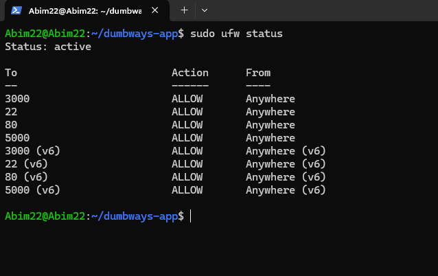  

---

## Step 9. Pengujian  
### Buka alamat server (`http://IP_SERVER`) di browser.  
1. Frontend `http://103.196.152.65:3000/login`
  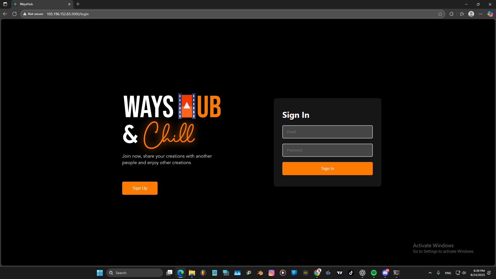  
2. Backend `http://103.196.152.65:5000`
  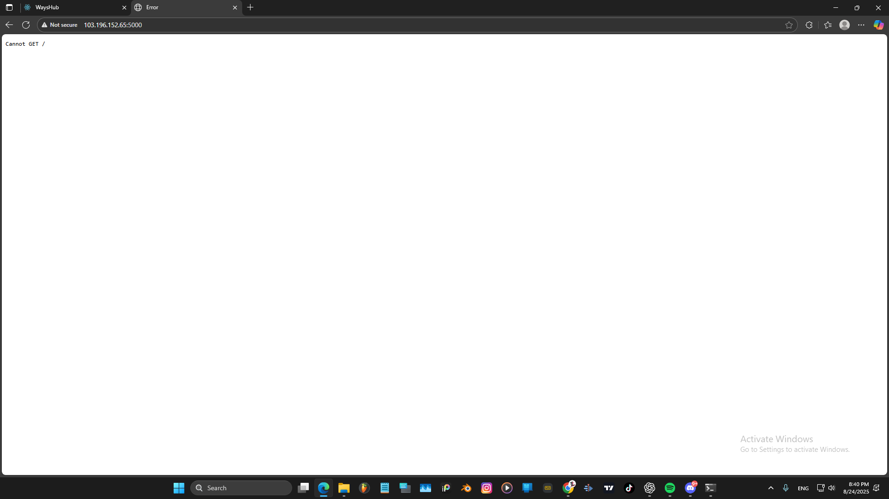  
3. Register user baru dan login.
  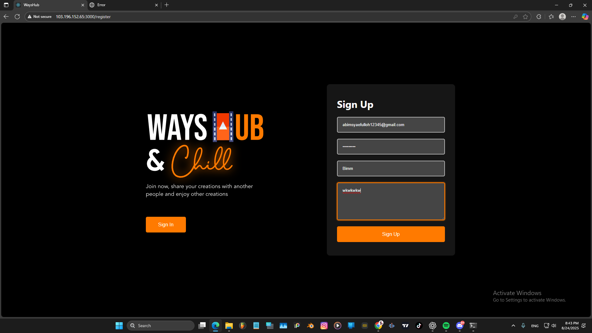  
  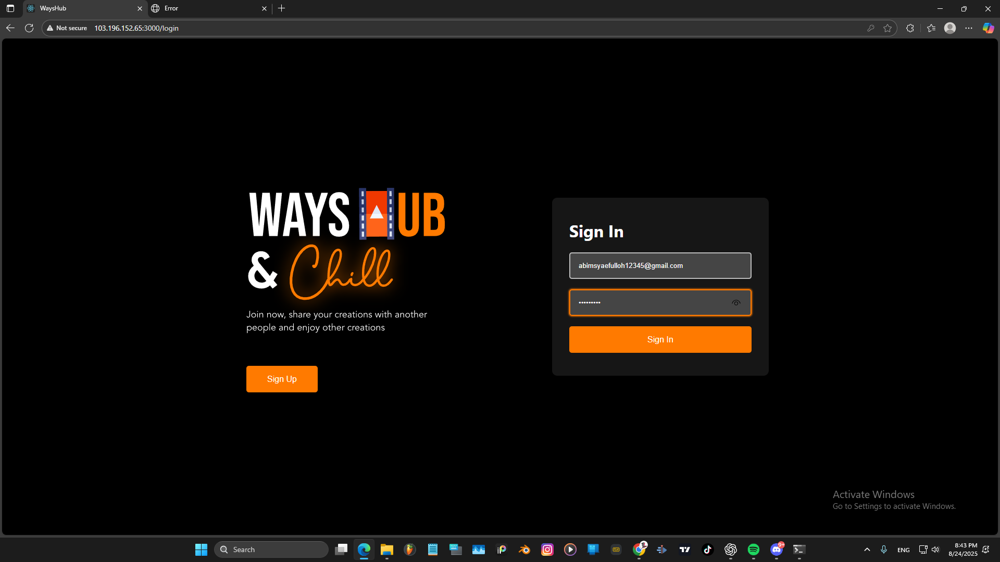
  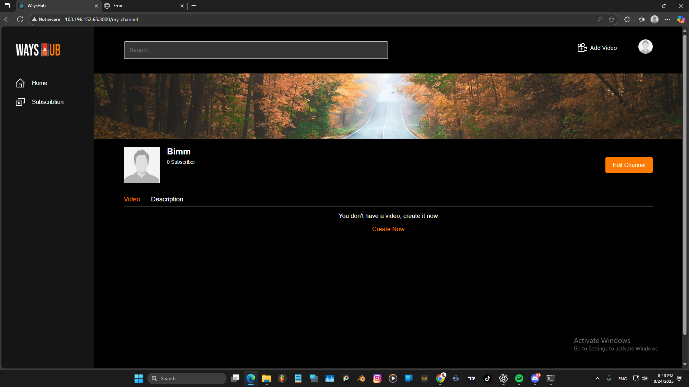  
### Cek pada database  
```bash
# Membuka mysql menggunakan username dan password
sudo mysql -u abim -p

# Melihat databases
SHOW DATABASES;

# Memilih databases
USE wayshub;

# Melihat table dari database yang dipilih
SELECT * FROM Chanels;
```
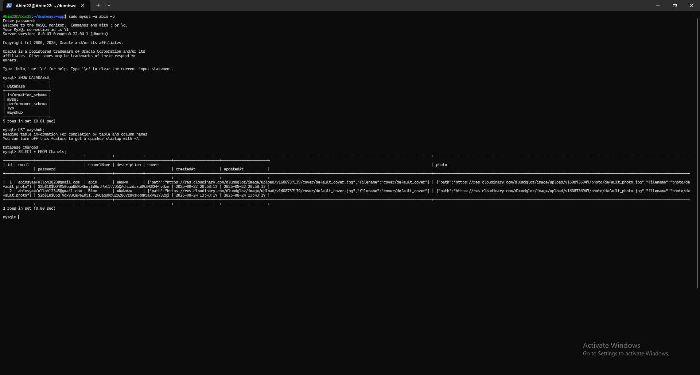  

---

## Kesimpulan  
Dengan langkah di atas, aplikasi Wayshub berhasil berjalan (frontend + backend), data tersimpan di MySQL Database, dan website berjalan di PM2.  
