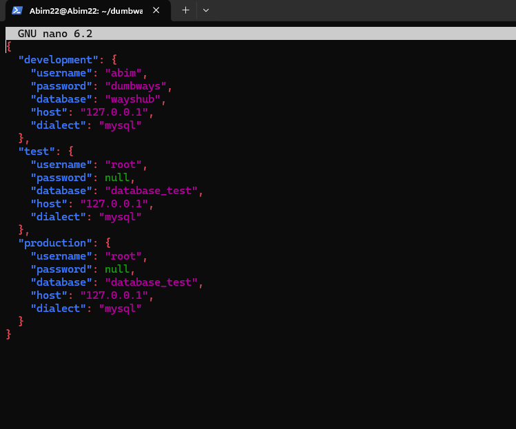

# Deploy Wayshub (Task Day 1 & 2)  
Pada tugas ini saya melakukan deploy aplikasi Wayshub dengan backend dan frontend berjalan pada satu server.  
Saya menggunakan **Ubuntu Server 22.04 LTS**, **MariaDB**, **PM2**, dan **Nginx** sebagai reverse proxy.  
---

## Step 1. Menyiapkan Sistem  
Update paket, install tool dasar, Node.js LTS (via nvm), dan PM2.  

### Update paket 
`sudo apt update` 

### Download dan install dari web browser Node.js LTS nya
  

### Memilih versi node dan mengecek versinya
`nvm install 12`  
`nvm use 12`  
`node -v dan npm -v`  

### Install PM2
`npm i -g pm2`  

  

---

## Step 2. Meng-clone Repository  
Saya meletakkan project di `~/dumbways-app`.  
```bash
mkdir -p ~/dumbways-app 
git clone https://github.com/dumbwaysdev/wayshub-backend
git clone https://github.com/dumbwaysdev/wayshub-frontend
```
  

---

## Step 3. Database (MySQL)
Saya menggunakan MySQL untuk database.
### Install dan menjalankan MySQL
`sudo apt install mysql-server`  
`sudo mysql`

### Mengatur password dan autentikasi user root di MySQL
`sudo mysql_secure_installation` yang isinya
```bash
1. Set root password → kalau belum ada password untuk user root, bisa diatur di sini.
2. Remove anonymous users → menghapus user anonim (tanpa nama) supaya orang asing nggak bisa akses Database.
3. Disallow root login remotely → menonaktifkan akses root dari luar server, biar root hanya bisa login dari localhost.
4. Remove test database → menghapus database “test” default bawaan MySQL yang bisa diakses siapa aja.
5. Reload privilege tables → menerapkan semua perubahan pengaturan keamanan tadi.
```
  

lalu jalankan `sudo mysql` lagi dan masukan command  
`ALTER USER 'root'@'localhost' IDENTIFIED WITH caching_sha2_password BY 'dumbways';`  
yang artinya untuk mengubah metode login user root agar pakai password.
```bash
1. ALTER USER → perintah untuk merubah/mengedit akun user di MySQL.
2. caching_sha2_password → plugin autentikasi default dari MySQL 8.
3. 'dumbways' → password yang saya gunakan untuk root.
```
`CREATE USER 'abim'@'%' IDENTIFIED BY 'dumbways';`  
yang artinya membuat user 'abim' yang nantinya bisa diakes manasaja menggunakan passowrd dumbways.  
`GRANT ALL PRIVIVEGES ON *.* TO 'abim'@'%';`  
artinya memberikan akses kesemua database dan table.  

### Masuk MySQL menggunakan user dan password.
`sudo mysql -u abim -p`  
  
### Membuat Database
```bash
# Masuk ke MySQL, dan buat database wayshub menggunakan command
CREATE DATABASE wayshub;
# Menampilkan semua database menggunakan  
SHOW DATABASES;
# Memilih database yang mau dipakai
USE wayshub;
# Menghapus database
DROP DATABASE wayshub;
# Menerapkan perubahan
FLUSH PRIVILEGES;
```


---

## Step 4. Konfigurasi Backend (Sequelize)  
Masuk ke folder backend dan install dependency.  
```bash
cd ~/dumbways-app/wayshub-backend
npm install
```
Buat file `.env` jika belum ada:  
```env
PORT=5000
DB_USERNAME=wayshub
DB_PASSWORD=passwordku-aman
DB_DATABASE=wayshub
DB_HOST=127.0.0.1
DB_DIALECT=mysql
JWT_SECRET=supersecretkey
```
Pastikan `config/config.json` sesuai dengan kredensial di atas (dialect `mysql`).  

Jalankan database init, migrasi, dan seed (jika tersedia):  
```bash
npx sequelize db:create
npx sequelize db:migrate
npx sequelize db:seed:all
```
Tes backend (opsional):  
```bash
npm start
curl http://localhost:5000/api/v1/health
```
  

---

## Step 5. Konfigurasi Frontend (Build)  
Masuk ke folder frontend, install dependency, dan atur baseURL API agar melalui Nginx path `/api`.  
```bash
cd ~/dumbways-app/wayshub-frontend
npm install
```
Edit `src/config/api.js`:  
```js
import axios from 'axios';
const API = axios.create({{ baseURL: "/api/v1" }});
export {{ API }};
```
Build React:  
```bash
npm run build
```
Hasil build akan berada di `wayshub-frontend/build`.  
  

---

## Step 6. Nginx Reverse Proxy  
Install dan konfigurasi Nginx untuk melayani file statis frontend dan mem-proxy API ke backend.  
```bash
sudo apt -y install nginx
sudo systemctl enable --now nginx
```
Buat file `/etc/nginx/sites-available/wayshub`:  
```nginx
server {{
    listen 80;
    server_name _;

    root /home/ubuntu/dumbways-app/wayshub-frontend/build;
    index index.html;

    location /api/ {{
        proxy_pass http://127.0.0.1:5000/api/;
        proxy_http_version 1.1;
        proxy_set_header X-Forwarded-For $proxy_add_x_forwarded_for;
        proxy_set_header X-Forwarded-Proto $scheme;
        proxy_set_header Host $host;
        proxy_set_header Upgrade $http_upgrade;
        proxy_set_header Connection "upgrade";
    }}

    location / {{
        try_files $uri /index.html;
    }}
}}
```
Aktifkan site dan reload Nginx:  
```bash
sudo ln -s /etc/nginx/sites-available/wayshub /etc/nginx/sites-enabled/wayshub
sudo nginx -t
sudo systemctl reload nginx
```
  

---

## Step 7. Menjalankan Backend dengan PM2  
Saya menggunakan PM2 untuk menjaga backend tetap berjalan di background.  
Buat file `ecosystem.config.js` di `~/dumbways-app`:  
```js
module.exports = {{
  apps: [
    {{
      name: "wayshub-backend",
      cwd: "./wayshub-backend",
      script: "npm",
      args: "start",
      env: {{
        NODE_ENV: "production",
        PORT: "5000"
      }},
      watch: false
    }}
  ]
}}
```
Jalankan dan simpan proses PM2:  
```bash
cd ~/dumbways-app
pm2 start ecosystem.config.js
pm2 save
pm2 startup
pm2 ls
pm2 logs wayshub-backend --lines 100
```
Ringkasan perintah PM2 yang saya gunakan:  
1. Start: `pm2 start ecosystem.config.js --only wayshub-backend`  
2. Restart: `pm2 restart wayshub-backend`  
3. List: `pm2 list`  
4. Logs: `pm2 logs wayshub-backend`  
5. Delete: `pm2 delete wayshub-backend`  
  

---

## Step 8. Firewall (UFW)  
Saya membuka port yang diperlukan (SSH dan HTTP).  
```bash
sudo ufw allow 22
sudo ufw allow 80
sudo ufw enable
sudo ufw status
```
  

---

## Step 9. Pengujian  
Buka alamat server (`http://IP_SERVER`) di browser.  
1. Register user baru dan login.  
2. Cek log backend:  
```bash
pm2 logs wayshub-backend --lines 200
```
3. Cek data pada database:  
```bash
sudo mysql -u root -p -e "USE wayshub; SHOW TABLES; SELECT * FROM users LIMIT 5;"
```
Jika data user muncul, berarti **berhasil**.  
  

---

## Catatan  
- Jika ada error **OpenSSL** saat jalankan React dev server, gunakan:  
  `export NODE_OPTIONS=--openssl-legacy-provider`  
- Jika API 404/CORS, pastikan `baseURL="/api/v1"` di frontend dan blok `location /api/` pada Nginx sudah benar, lalu reload Nginx.  
- Jika Sequelize gagal konek, periksa `.env` dan `config/config.json`, lalu ulang migrasi.  

---

## Kesimpulan  
Dengan langkah di atas, aplikasi Wayshub berhasil berjalan (frontend + backend), data tersimpan di MariaDB, dan backend dikelola oleh PM2.  
