```bash
TUGAS :
Sebelum mengerjakan tugas, mohon persiapkan :
- Akun Github dan buat repository dengan judul "devops24-dumbways-<nama kalian>"
- Gunakan file README.md untuk isi tugas kalian
- Buatlah langkah-langkah pengerjaan tugas beserta dokumentasinya

Repository & Reference:
[Jenkins Installation](https://www.jenkins.io/doc/book/installing/)
[wget spider](https://www.labnol.org/software/wget-command-examples/28750/)


Tasks :
[ Jenkins ]
- Reverse Proxy Jenkins
  - gunakan domain ex. pipeline-team.studentdumbways.my.id
- Buatlah beberapa Job untuk aplikasi kalian
  - Job Frontend
  - Job Backend
- Buat Jenkinsfile dengan proses seperti ini :
     - Pull dari repository
     - Dockerize/Build aplikasi kita
     - Test application
     - Deploy aplikasi on top Docker
     - Push ke Docker Hub
- Auto trigger setiap ada perubahan di SCM (setiap repository berubah, otomatis menjalankan build)
```
# Insatall Jenkins di App Server 2
### Membuat direktori jenkins dan Insatall jenkins lewat dokumntasi di github  
`https://github.com/jenkinsci/docker/blob/master/README.md`  
`docker run -d -v jenkins_home:/var/jenkins_home -p 8080:8080 -p 50000:50000 --restart=on-failure jenkins/jenkins:lts-jdk17`  
Ini akan menjalankan Jenkins dalam mode terpisah dengan penerusan porta dan penambahan volume.  
Anda dapat mengakses log dengan perintah 'docker logs CONTAINER_ID' untuk memeriksa token login pertama.  
ID kontainer akan dikembalikan dari keluaran perintah di atas.

### Mengecek jenkins yang jalan di container 
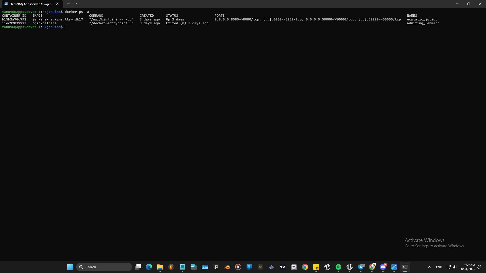

### Konfigurasi Jenkins
- Unlock Jenkins, masuk ke dalam logs container jenkinsnya untuk melihat passwordnya  
  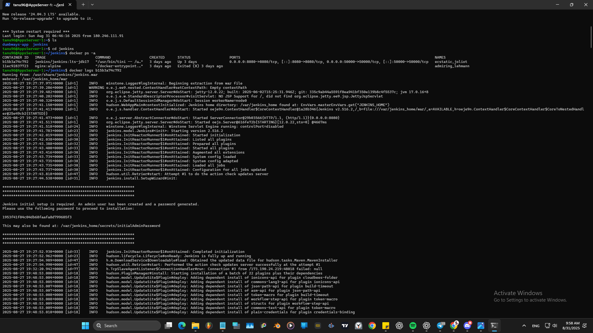  
  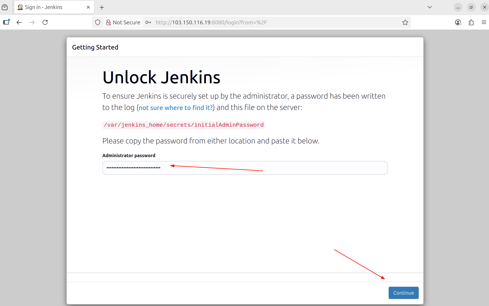  
- Customize Jenkins  
  `select plugin to install` 
  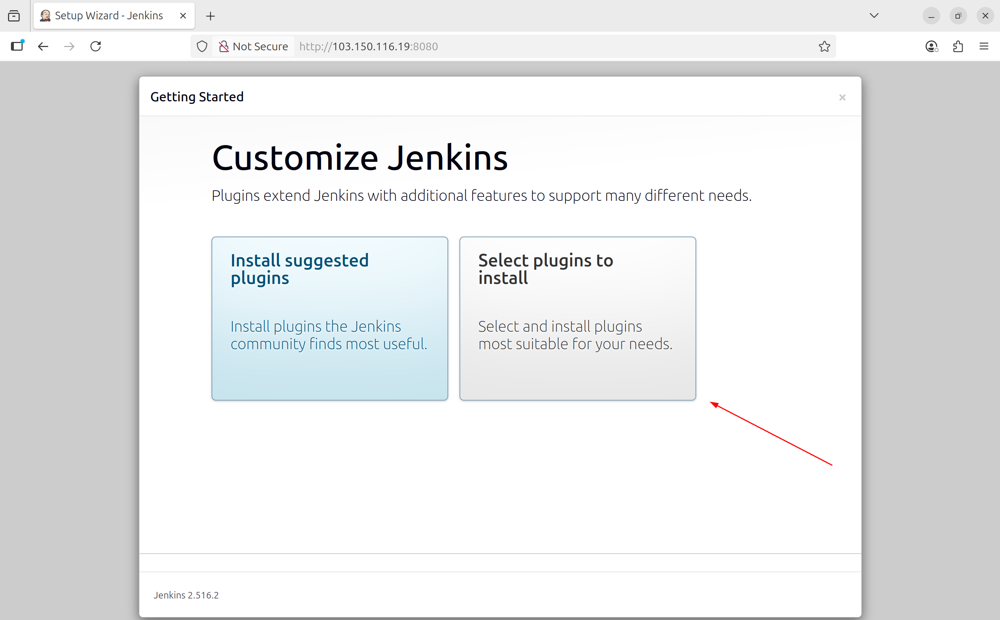
- Organiztion and Adiministration, di centang semua
  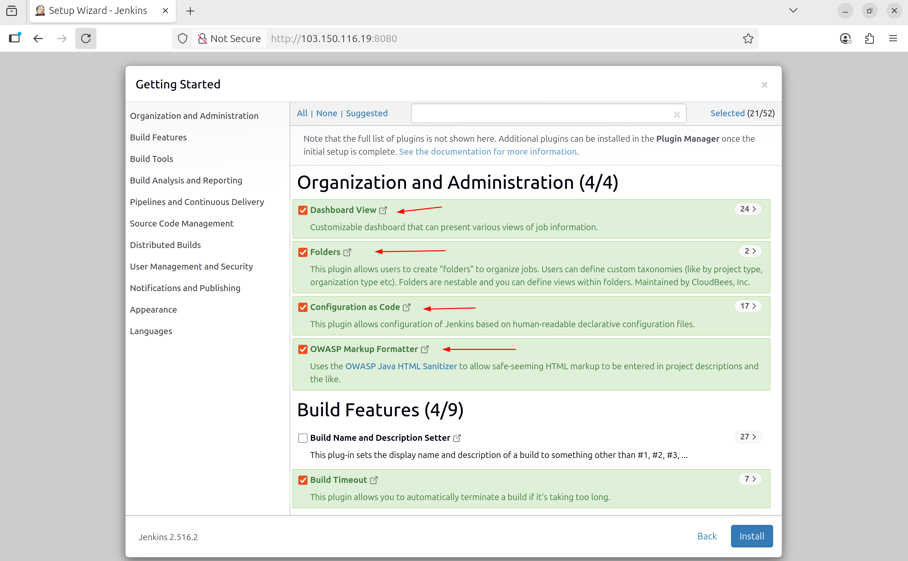 
- Build Features, centang bagian SSH Agent 
- Source Code Management, centang bagian Git
  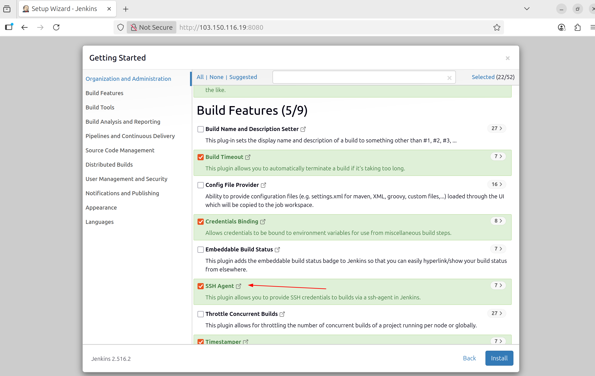 
- Tampilan setup instalasinya
  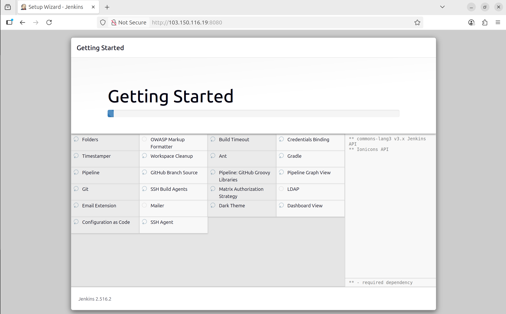  
- Create First Admin User  
  menggunakan username `admin` dan password jenkins sebelumnya   `1953f41f04c04db68faafa8d799605f3`
  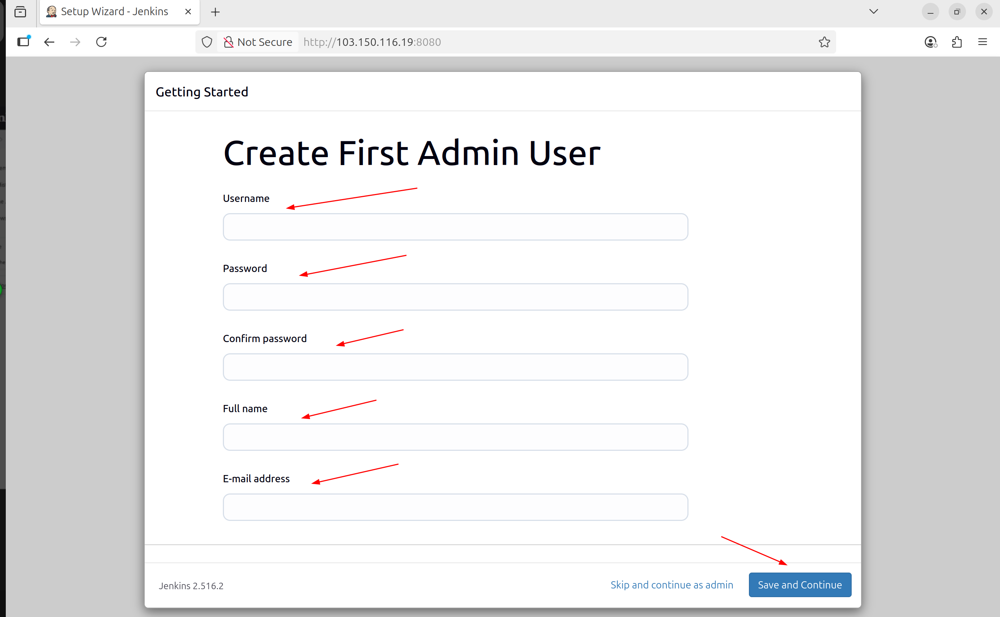  
- Instace Configuration,
  untuk mengatur jenkins url bisa menggunakan domain yang        sudah terdaftar atau ip address 
  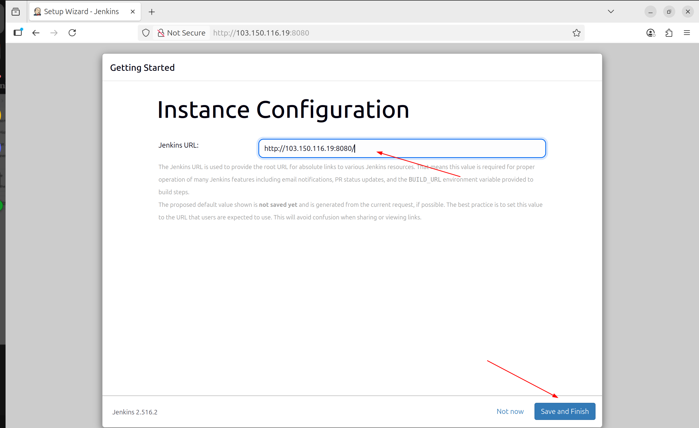  
- Jenkins is ready, 
  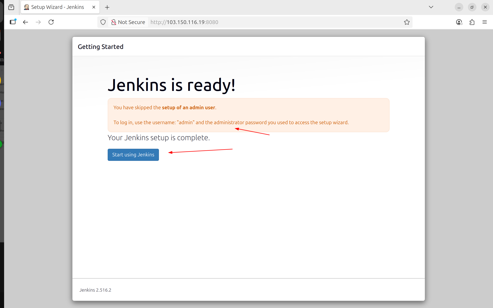  
- Login ke Jenkins dan Konfigurasi  
  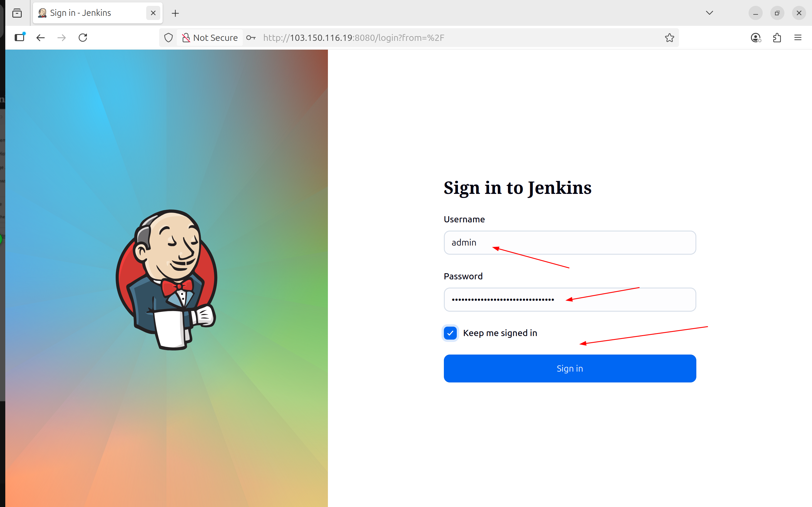


