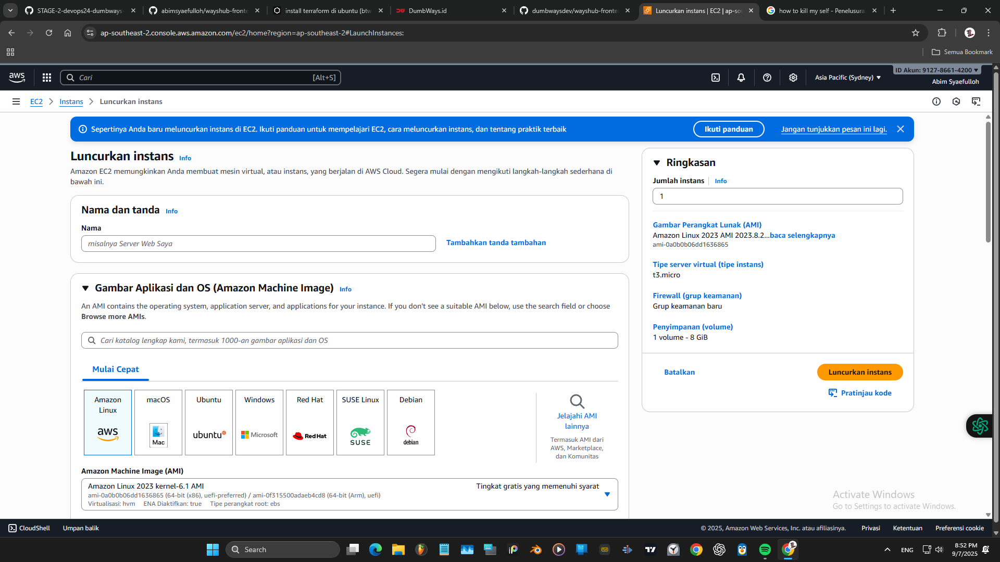
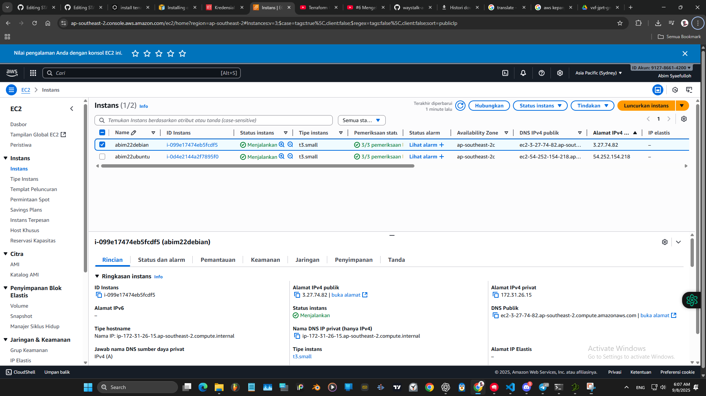
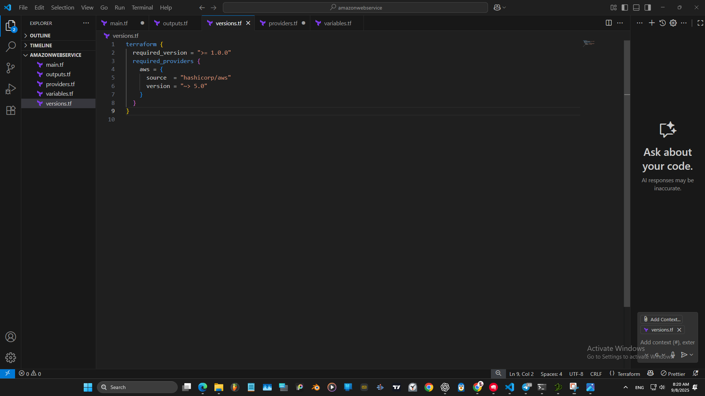
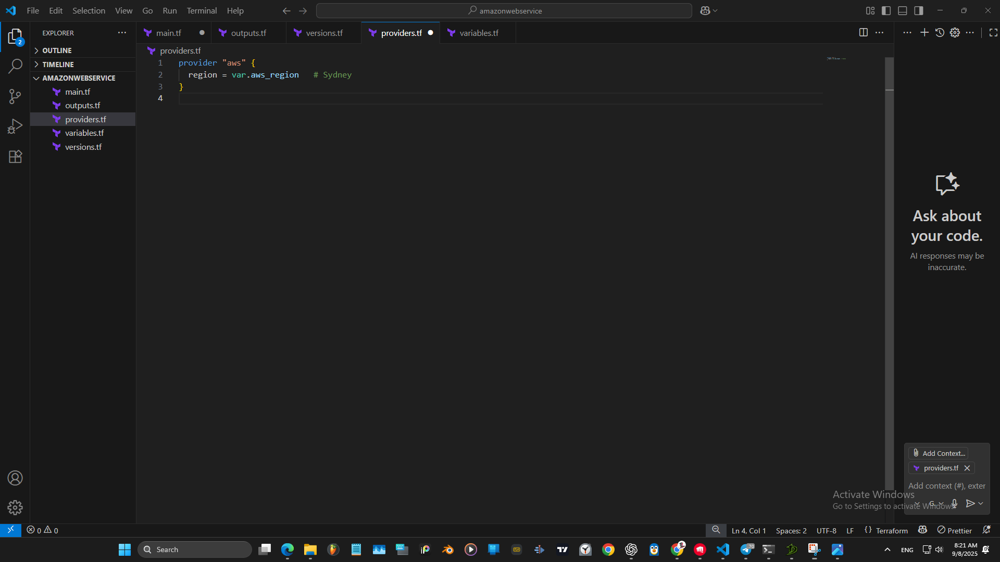
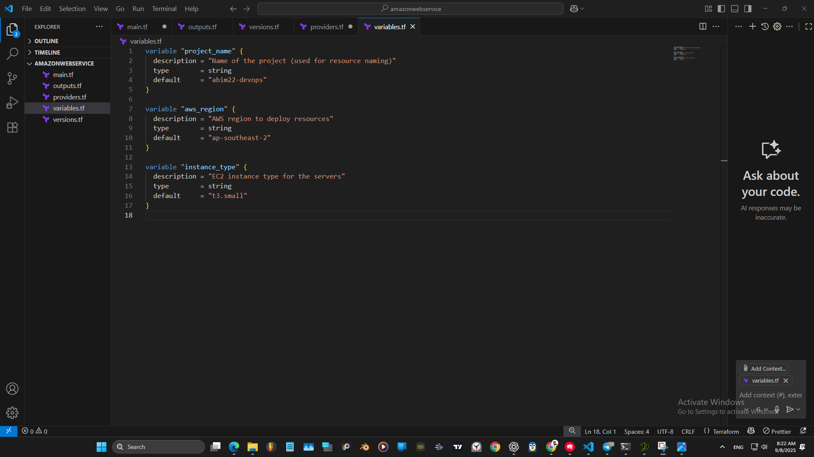
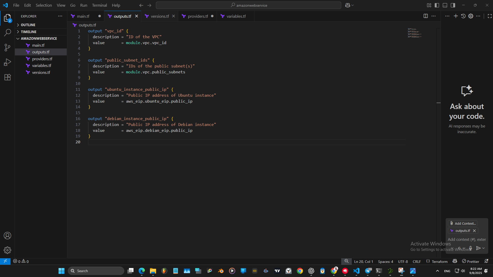
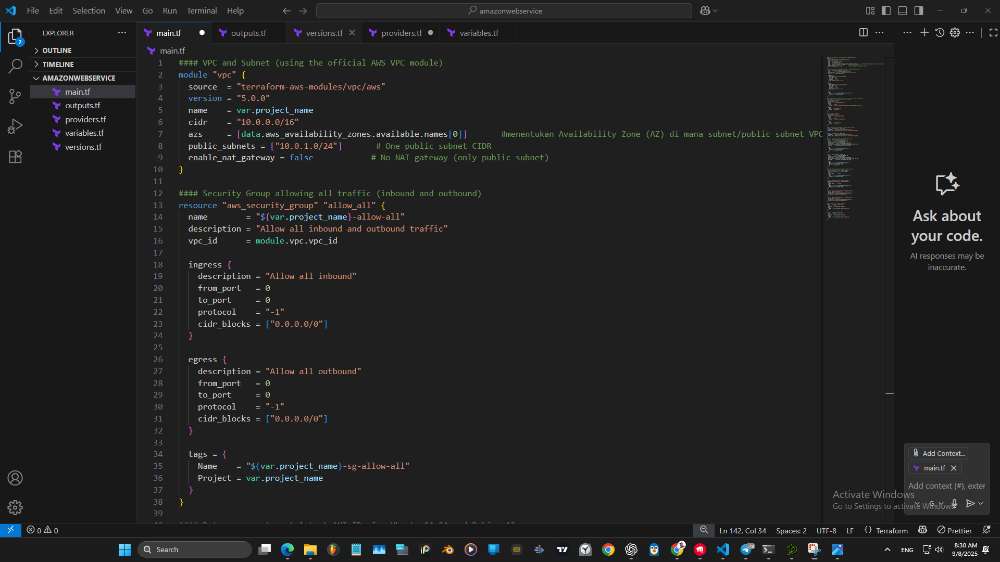

```bash
Task:
- Dengan mendaftar akun free tier AWS/GCP/Azure,
buatlah Infrastructre dengan terraform menggunakan registry yang sudah ada.
dengan beberapa aturan berikut :
   - Buatlah 2 buah server dengan OS ubuntu 24 dan debian 11 (Untuk spec menyesuaikan)
   - attach vpc ke dalam server tersebut
   - attach ip static ke vm yang telah kalian buat
   - pasang firewall ke dalam server kalian dengan rule {allow all ip(0.0.0.0/0)}
   - buatlah 2 block storage di dalam terraform kalian,
     lalu attach block storage tersebut ke dalam server yang ingin kalian buat.
     (pasang 1 ke server ubuntu dan  1 di server debian)
   - test ssh ke server
- Buat terraform code kalian serapi mungkin
 - simpan script kalian ke dalam github dengan format tree sebagai berikut:
```sh
  Automation  
  |  
  | Terraform
  └─|  └── gcp
          │ └── main.tf
          │ └── providers.tf
          │ └── etc
          ├── aws
          │ └── main.tf
          │ └── providers.tf
          │ └── etc
          ├── azure
          │ └── main.tf
          │ └── providers.tf
          │ └── etc

Reference :
[Amazon Web Services (AWS)](https://aws.amazon.com/free/)
[Google Cloud Platform (GCP)](https://cloud.google.com/free)
[Microsoft Azure](https://azure.microsoft.com/en-us/pricing/free-services)
```
Tentu! Berikut saya buatkan langkah-langkah pengerjaan tugas Day 5 (Terraform) dan Day 6 (Ansible) secara terpisah tanpa kode, sesuai permintaanmu.

---

## Langkah-langkah Tugas Day 5 - Terraform (Infrastruktur Cloud)

## 1. Persiapan Akun Cloud
- Daftar akun free tier di AWS 
- Install Terraform & AWS CLI  
  Terraform  
  `https://developer.hashicorp.com/terraform/install#linux`  
  AWS CLI  
  `https://docs.aws.amazon.com/cli/latest/userguide/getting-started-install.html`
- AWS configure, isi Access Key, Secret, region dan output format



---

## 2. Setup Project dan Struktur Folder
```bash
  Automation  
  |  
  | Terraform
  └─|  └── aws
          │ └── main.tf
          │ └── providers.tf
          │ └── outputs.tf
          │ └── variables.tf   
          │ └── version.tf
```

---

## 3. Server VM
   - Buat 2 VM:  
     - 1 dengan OS Ubuntu 24  
     - 1 dengan OS Debian 13  


---

## 4. Setup terraform
### versions.tf
```bash
Mengunci versi Terraform & provider supaya konsisten di semua mesin.
- minimal versi
- daftar provider
```


### providers.tf
```bash
- Mengatur provider AWS
- Region default tempat resource dibuat
```


### variables.tf
```bash
Mendefinisikan input yang bisa kamu isi saat terraform apply atau diubah default-nya:
- project_name (penamaan resource),
- aws_region (contoh: ap-southeast-2),
- instance_type (contoh: t3.small).
```


### outputs.tf
```bash
Menampilkan ringkasan hasil setelah apply:
- vpc_id, public_subnet_ids,
- ubuntu_instance_public_ip, debian_instance_public_ip.
```


### main.tf
```bash
- bikin VPC (Virtual Private Cloud) + subnet lewat module,
- bikin security group (atur port SSH, HTTP, HTTPS),
- ambil AMI (Amazon Machine Image) terbaru untuk Ubuntu & Debian,
- bikin key pair dari public key lokal,
- bikin 2 instance EC2 (Ubuntu & Debian) + attach EBS volume tambahan,
- kasih Elastic IP ke masing-masing instance,
```



```bash
#### VPC and Subnet (using the official AWS VPC module)
module "vpc" {
  source  = "terraform-aws-modules/vpc/aws"
  version = "5.0.0"
  name    = var.project_name
  cidr    = "10.0.0.0/16"
  azs     = [data.aws_availability_zones.available.names[0]]       #menentukan Availability Zone (AZ) di mana subnet/public subnet VPC dibuat
  public_subnets = ["10.0.1.0/24"]       # One public subnet CIDR
  enable_nat_gateway = false            # No NAT gateway (only public subnet)
}

#### Security Group allowing all traffic (inbound and outbound)
resource "aws_security_group" "allow_all" {
  name        = "${var.project_name}-allow-all"
  description = "Allow all inbound and outbound traffic"
  vpc_id      = module.vpc.vpc_id

  ingress {
    description = "Allow all inbound"
    from_port   = 0
    to_port     = 0
    protocol    = "-1"
    cidr_blocks = ["0.0.0.0/0"]
  }

  egress {
    description = "Allow all outbound"
    from_port   = 0
    to_port     = 0
    protocol    = "-1"
    cidr_blocks = ["0.0.0.0/0"]
  }

  tags = {
    Name    = "${var.project_name}-sg-allow-all"
    Project = var.project_name
  }
}

#### Data sources to get latest AMI IDs for Ubuntu 24.04 and Debian 13
# Using official owner IDs (Ubuntu) and Debian 
data "aws_ami" "ubuntu" {
  most_recent = true
  owners      = ["099720109477"]             
  filter {
    name   = "name"
    values = ["ubuntu/images/hvm-ssd/ubuntu-*24.04-amd64-server-*"]
  }
  filter {
    name   = "architecture"
    values = ["x86_64"]
  }
}

data "aws_ami" "debian" {
  most_recent = true
  owners      = ["136693071363"]             
  filter {
    name   = "name"
    values = ["debian-13-amd64-*"]
  }
  filter {
    name   = "architecture"
    values = ["x86_64"]
  }
}

#### Import existing SSH public keys as AWS key pairs
resource "aws_key_pair" "ubuntu" {
  key_name   = "${var.project_name}-ubuntu-key"
  public_key = file("/mnt/c/Users/user/.ssh/awsubuntu.pem")
}

resource "aws_key_pair" "debian" {
  key_name   = "${var.project_name}-debian-key"
  public_key = file("/mnt/c/Users/user/.ssh/awsdebian.pem")
}

#### EC2 Instances (Ubuntu 24.04 and Debian 13)
resource "aws_instance" "ubuntu" {
  ami           = data.aws_ami.ubuntu.id
  instance_type = var.instance_type
  subnet_id     = module.vpc.public_subnets[0]
  vpc_security_group_ids = [aws_security_group.allow_all.id]
  key_name      = aws_key_pair.ubuntu.key_name

  tags = {
    Name    = "${var.project_name}-ubuntu"
    Project = var.project_name
    OS      = "Ubuntu 24.04"
  }
}

resource "aws_instance" "debian" {
  ami           = data.aws_ami.debian.id
  instance_type = var.instance_type
  subnet_id     = module.vpc.public_subnets[0]
  vpc_security_group_ids = [aws_security_group.allow_all.id]
  key_name      = aws_key_pair.debian.key_name

  tags = {
    Name    = "${var.project_name}-debian"
    Project = var.project_name
    OS      = "Debian 13"
  }
}

#### Additional 8 GB EBS volumes for each instance
resource "aws_ebs_volume" "ubuntu_volume" {
  availability_zone = "${var.aws_region}a"
  size              = 8
  volume_type       = "gp3"
  tags = {
    Name    = "${var.project_name}-ubuntu-vol"
    Project = var.project_name
  }
}

resource "aws_ebs_volume" "debian_volume" {
  availability_zone = "${var.aws_region}a"
  size              = 8
  volume_type       = "gp3"
  tags = {
    Name    = "${var.project_name}-debian-vol"
    Project = var.project_name
  }
}

resource "aws_volume_attachment" "ubuntu_attach" {
  device_name = "/dev/sdf"
  volume_id   = aws_ebs_volume.ubuntu_volume.id
  instance_id = aws_instance.ubuntu.id
}

resource "aws_volume_attachment" "debian_attach" {
  device_name = "/dev/sdf"
  volume_id   = aws_ebs_volume.debian_volume.id
  instance_id = aws_instance.debian.id
}

#### Elastic IPs for each instance
resource "aws_eip" "ubuntu_eip" {
  vpc      = true
  instance = aws_instance.ubuntu.id
  tags = {
    Name = "${var.project_name}-ubuntu-eip"
  }
}

resource "aws_eip" "debian_eip" {
  vpc      = true
  instance = aws_instance.debian.id
  tags = {
    Name = "${var.project_name}-debian-eip"
  }
}
#### VPC and Subnet (using the official AWS VPC module)
module "vpc" {
  source  = "terraform-aws-modules/vpc/aws"
  version = "5.0.0"
  name    = var.project_name
  cidr    = "10.0.0.0/16"
  azs     = [data.aws_availability_zones.available.names[0]]       #menentukan Availability Zone (AZ) di mana subnet/public subnet VPC dibuat
  public_subnets = ["10.0.1.0/24"]       # One public subnet CIDR
  enable_nat_gateway = false            # No NAT gateway (only public subnet)
}

#### Security Group allowing all traffic (inbound and outbound)
resource "aws_security_group" "allow_all" {
  name        = "${var.project_name}-allow-all"
  description = "Allow all inbound and outbound traffic"
  vpc_id      = module.vpc.vpc_id

  ingress {
    description = "Allow all inbound"
    from_port   = 0
    to_port     = 0
    protocol    = "-1"
    cidr_blocks = ["0.0.0.0/0"]
  }

  egress {
    description = "Allow all outbound"
    from_port   = 0
    to_port     = 0
    protocol    = "-1"
    cidr_blocks = ["0.0.0.0/0"]
  }

  tags = {
    Name    = "${var.project_name}-sg-allow-all"
    Project = var.project_name
  }
}

#### Data sources to get latest AMI IDs for Ubuntu 24.04 and Debian 13
# Using official owner IDs (Ubuntu) and Debian 
data "aws_ami" "ubuntu" {
  most_recent = true
  owners      = ["099720109477"]             
  filter {
    name   = "name"
    values = ["ubuntu/images/hvm-ssd/ubuntu-*24.04-amd64-server-*"]
  }
  filter {
    name   = "architecture"
    values = ["x86_64"]
  }
}

data "aws_ami" "debian" {
  most_recent = true
  owners      = ["136693071363"]             
  filter {
    name   = "name"
    values = ["debian-13-amd64-*"]
  }
  filter {
    name   = "architecture"
    values = ["x86_64"]
  }
}

#### Import existing SSH public keys as AWS key pairs
resource "aws_key_pair" "ubuntu" {
  key_name   = "${var.project_name}-ubuntu-key"
  public_key = file("/mnt/c/Users/user/.ssh/awsubuntu.pem")
}

resource "aws_key_pair" "debian" {
  key_name   = "${var.project_name}-debian-key"
  public_key = file("/mnt/c/Users/user/.ssh/awsdebian.pem")
}

#### EC2 Instances (Ubuntu 24.04 and Debian 13)
resource "aws_instance" "ubuntu" {
  ami           = data.aws_ami.ubuntu.id
  instance_type = var.instance_type
  subnet_id     = module.vpc.public_subnets[0]
  vpc_security_group_ids = [aws_security_group.allow_all.id]
  key_name      = aws_key_pair.ubuntu.key_name

  tags = {
    Name    = "${var.project_name}-ubuntu"
    Project = var.project_name
    OS      = "Ubuntu 24.04"
  }
}

resource "aws_instance" "debian" {
  ami           = data.aws_ami.debian.id
  instance_type = var.instance_type
  subnet_id     = module.vpc.public_subnets[0]
  vpc_security_group_ids = [aws_security_group.allow_all.id]
  key_name      = aws_key_pair.debian.key_name

  tags = {
    Name    = "${var.project_name}-debian"
    Project = var.project_name
    OS      = "Debian 13"
  }
}

#### Additional 8 GB EBS volumes for each instance
resource "aws_ebs_volume" "ubuntu_volume" {
  availability_zone = "${var.aws_region}a"
  size              = 8
  volume_type       = "gp3"
  tags = {
    Name    = "${var.project_name}-ubuntu-vol"
    Project = var.project_name
  }
}

resource "aws_ebs_volume" "debian_volume" {
  availability_zone = "${var.aws_region}a"
  size              = 8
  volume_type       = "gp3"
  tags = {
    Name    = "${var.project_name}-debian-vol"
    Project = var.project_name
  }
}

resource "aws_volume_attachment" "ubuntu_attach" {
  device_name = "/dev/sdf"
  volume_id   = aws_ebs_volume.ubuntu_volume.id
  instance_id = aws_instance.ubuntu.id
}

resource "aws_volume_attachment" "debian_attach" {
  device_name = "/dev/sdf"
  volume_id   = aws_ebs_volume.debian_volume.id
  instance_id = aws_instance.debian.id
}

#### Elastic IPs for each instance
resource "aws_eip" "ubuntu_eip" {
  vpc      = true
  instance = aws_instance.ubuntu.id
  tags = {
    Name = "${var.project_name}-ubuntu-eip"
  }
}

resource "aws_eip" "debian_eip" {
  vpc      = true
  instance = aws_instance.debian.id
  tags = {
    Name = "${var.project_name}-debian-eip"
  }
}

```


9. **Inisialisasi dan Deploy Terraform**  
   - Jalankan `terraform init` untuk inisialisasi  
   - Jalankan `terraform plan` untuk melihat rencana provisioning  
   - Jalankan `terraform apply` untuk membuat resource di cloud

10. **Testing dan Verifikasi**  


---
