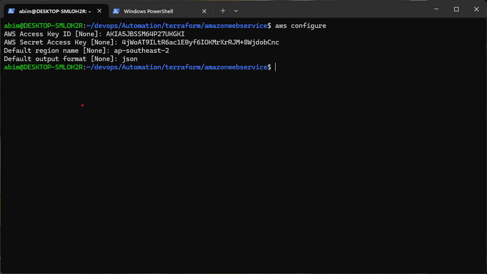

```bash
Task:
- Dengan mendaftar akun free tier AWS/GCP/Azure,
buatlah Infrastructre dengan terraform menggunakan registry yang sudah ada.
dengan beberapa aturan berikut :
   - Buatlah 2 buah server dengan OS ubuntu 24 dan debian 11 (Untuk spec menyesuaikan)
   - attach vpc ke dalam server tersebut
   - attach ip static ke vm yang telah kalian buat
   - pasang firewall ke dalam server kalian dengan rule {allow all ip(0.0.0.0/0)}
   - buatlah 2 block storage di dalam terraform kalian,
     lalu attach block storage tersebut ke dalam server yang ingin kalian buat.
     (pasang 1 ke server ubuntu dan  1 di server debian)
   - test ssh ke server
- Buat terraform code kalian serapi mungkin
 - simpan script kalian ke dalam github dengan format tree sebagai berikut:
```sh
  Automation  
  |  
  | Terraform
  └─|  └── gcp
          │ └── main.tf
          │ └── providers.tf
          │ └── etc
          ├── aws
          │ └── main.tf
          │ └── providers.tf
          │ └── etc
          ├── azure
          │ └── main.tf
          │ └── providers.tf
          │ └── etc

Reference :
[Amazon Web Services (AWS)](https://aws.amazon.com/free/)
[Google Cloud Platform (GCP)](https://cloud.google.com/free)
[Microsoft Azure](https://azure.microsoft.com/en-us/pricing/free-services)
```
Tentu! Berikut saya buatkan langkah-langkah pengerjaan tugas Day 5 (Terraform) dan Day 6 (Ansible) secara terpisah tanpa kode, sesuai permintaanmu.

---

## Langkah-langkah Tugas Day 5 - Terraform (Infrastruktur Cloud)

## 1. Persiapan Akun Cloud
- Daftar akun free tier di AWS 
- Install Terraform & AWS CLI  
  Terraform  
  `https://developer.hashicorp.com/terraform/install#linux`
  AWS CLI  
  `https://docs.aws.amazon.com/cli/latest/userguide/getting-started-install.html`
- AWS configure, isi Access Key, Secret, region dan output format




---

## 2. Setup Project dan Struktur Folder
```bash
  Automation  
  |  
  | Terraform
  └─|  └── aws
          │ └── main.tf
          │ └── providers.tf
          │ └── outputs.tf
          │ └── variables.tf   
          │ └── version.tf
```

---

## 3. Provision Server VM  
   - Buat 2 VM:  
     - 1 dengan OS Ubuntu 24  
     - 1 dengan OS Debian 13  


---

## 4. Setup terraform
### versions.tf
```bash
Mengunci versi Terraform & provider supaya konsisten di semua mesin.
- minimal versi
- daftar provider
```


### providers.tf
```bash
- Mengatur provider AWS
- Region default tempat resource dibuat
```


### variables.tf
```bash
Mendefinisikan input yang bisa kamu isi saat terraform apply atau diubah default-nya:
- project_name (penamaan resource),
- aws_region (contoh: ap-southeast-2),
- instance_type (contoh: t3.small).
```


### outputs.tf
```bash
Menampilkan ringkasan hasil setelah apply:
- vpc_id, public_subnet_ids,
- ubuntu_instance_public_ip, debian_instance_public_ip.
```


### main.tf


9. **Inisialisasi dan Deploy Terraform**  
   - Jalankan `terraform init` untuk inisialisasi  
   - Jalankan `terraform plan` untuk melihat rencana provisioning  
   - Jalankan `terraform apply` untuk membuat resource di cloud

10. **Testing dan Verifikasi**  


---
