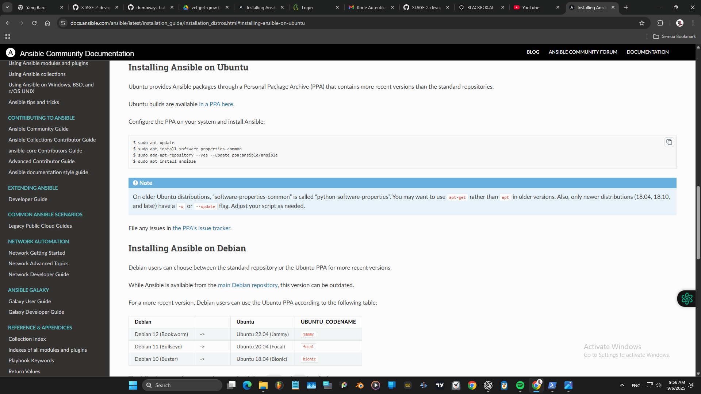
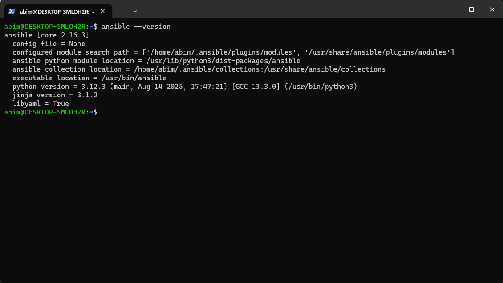
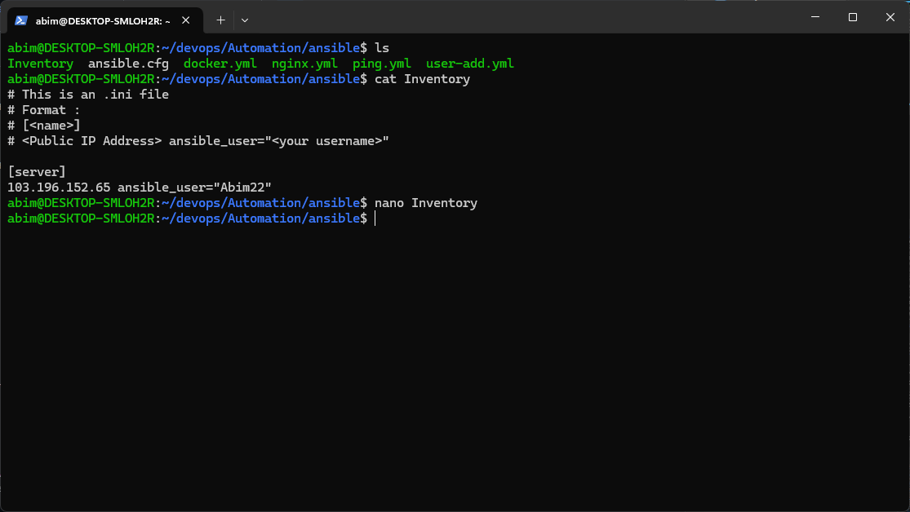
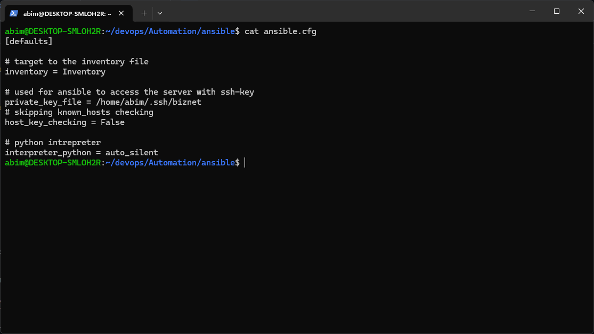
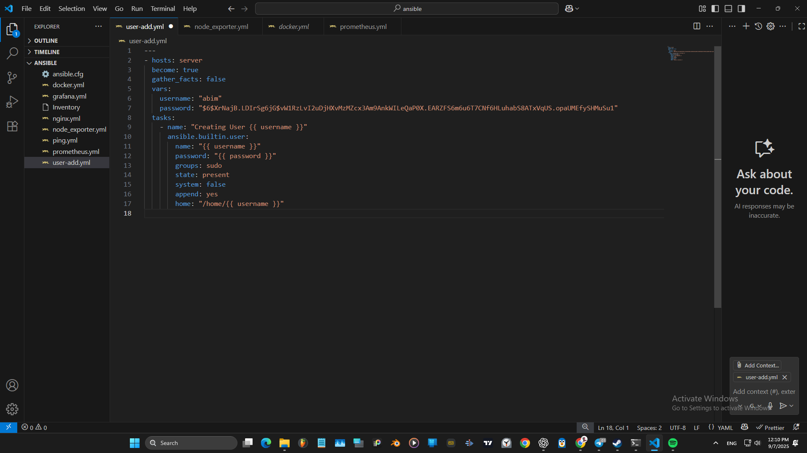
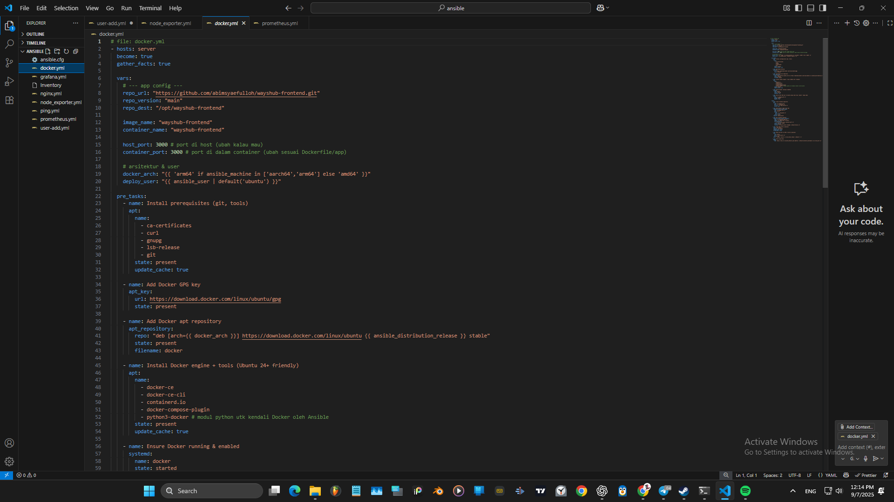
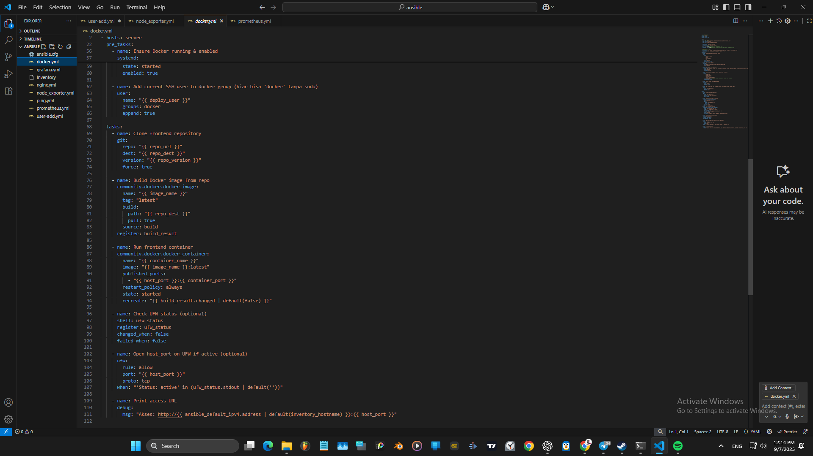
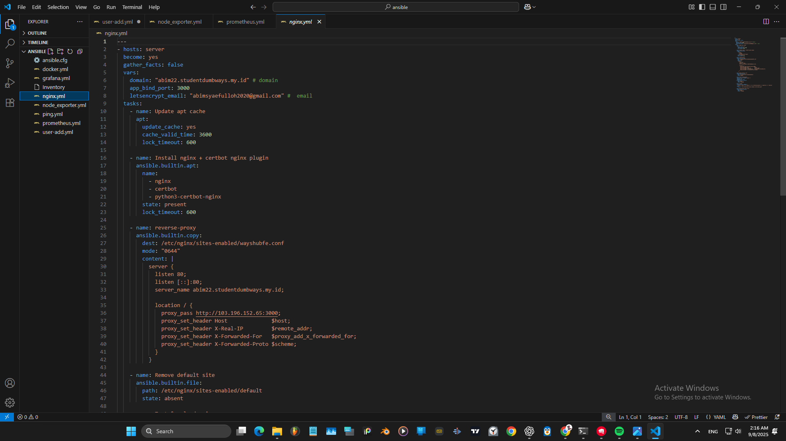
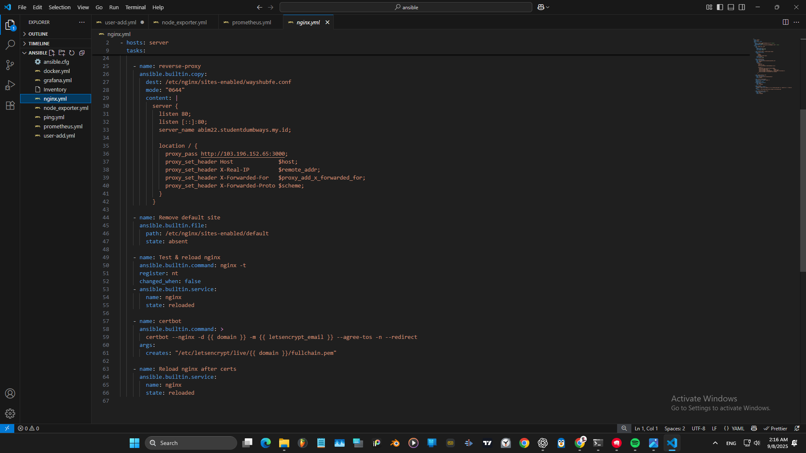
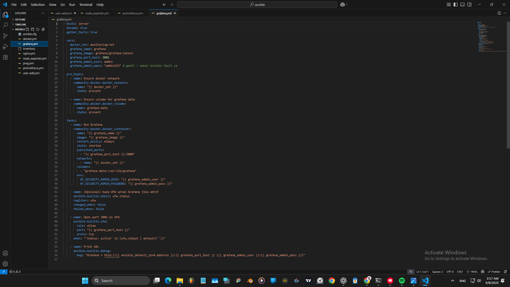

```bash
Sebelum mengerjakan tugas, mohon persiapkan :
- Akun Github dan buat repository dengan judul "devops24-dumbways-<nama kalian>"
- Gunakan file README.md untuk isi tugas kalian
- Buatlah langkah-langkah pengerjaan tugas beserta dokumentasinya

=========================================
**Reference**
[ansible-installation](https://docs.ansible.com/ansible/latest/installation_guide/installation_distros.html)
[ansible-module](https://docs.ansible.com/ansible/2.9/modules/list_of_all_modules.html)


**Ansible**

[Local]
Buat konfigurasi Ansible & sebisa mungkin maksimalkan penggunaan ansbile untuk melakukan semua setup dan se freestyle kalian 

[ansible]
Buatlah ansible untuk :
 - Membuat user baru, gunakan login ssh key & password
 - Instalasi Docker
 - Deploy application frontend yang sudah kalian gunakan sebelumnya menggunakan ansible.
 - Instalasi Monitoring Server (node exporter, prometheus, grafana)
 - Setup reverse-proxy
 - Generated SSL certificate
 - simpan script kalian ke dalam github dengan format tree sebagai berikut:
  Automation  
  |  
  | Terraform
  └─|   └── gcp
       │   └── main.tf
       │    └── providers.tf
       │    └── etc
       │   ├── aws
       │    └── main.tf
       │    └── providers.tf
       │    └── etc
       │  ├── azure
       │    └── main.tf
       │    └── providers.tf
       │    └── etc
    Ansible
    ├── ansible.cfg
    ├── lolrandom1.yaml
    ├── group_vars
    │ └── all
    ├── Inventory
    ├── lolrandom2.yaml
    └── lolrandom3.yaml
```

# Tugas Day 6 

## 1. Install Ansible 
`https://docs.ansible.com/ansible/latest/installation_guide/installation_distros.html#installing-ansible-on-ubuntu`  
  
  
Disini saya memngunakan wsl Ubuntu di windows

---

## 2. Konfigurasi Inventory  
Mengisi IP Address dan User
  
Kelompokkan server jika perlu

---

## 3. Konfigurasi asible.cfg
```bash
inventory = Inventory
menentukan file (inventory) yang akan dipakai.
private_key_file = /home/abim/.ssh/biznet
Ansible pakai SSH key ini untuk login ke server.
host_key_checking = False
Nonaktifkan pengecekan known_hosts (biar nggak ribet, tapi agak kurang aman).
interpreter_python = auto_silent
Biarkan Ansible otomatis pilih Python di host remote tanpa kasih warning.
```
  

---

## 4. Membuat playbook User Baru
  
Buat playbook untuk membuat user baru di server  
- user : abim
- password : abim12345 (terenkripsi)
Konfigurasi login menggunakan SSH key dan password

---

## 5. Playbook Instalasi Docker dan Deploy Aplikasi Frontend
Buat playbook untuk menginstall Docker, deployment aplikasi frontend.
- clone repo `https://github.com/abimsyaefulloh/wayshub-frontend.git`
- install git, dan periperal
- setup port
- install docker 
- Build images
- run container frontend
 
 

---

## 6. Membuat playbook Nginx, reverse proxy, certbot 
- setup domain dan email
- install nginx, certbot 
- setup reverse proxy, reload nginx
- setup certbot 
 


---

### 7. Playbook Instalasi Monitoring Server   
- Instal node exporter, Prometheus, dan Grafana menggunakan Ansible  
- Konfigurasi monitoring agar bisa memantau server
 

---

### Verifikasi Playbook
---

Kalau kamu mau, saya juga bisa bantu buatkan template README.md untuk dokumentasi tugasmu. Semoga membantu!
