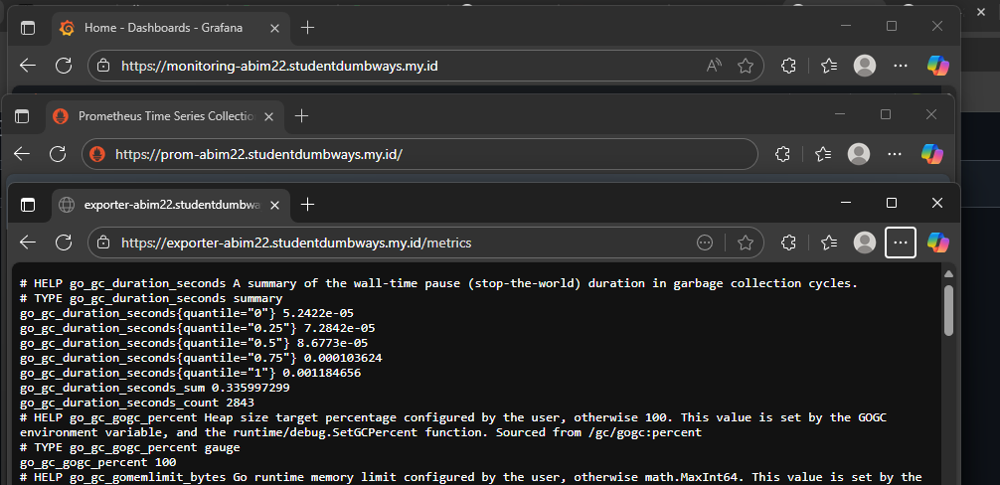

```bash
Sebelum mengerjakan tugas, mohon persiapkan :
- Akun Github dan buat repository dengan judul "devops24-dumbways-<nama kalian>"
- Gunakan file README.md untuk isi tugas kalian
- Buatlah langkah-langkah pengerjaan tugas beserta dokumentasinya

Docker Images :
[node-exporter](https://hub.docker.com/r/prom/node-exporter)
[Prometheus](https://hub.docker.com/r/prom/prometheus)
[Grafana Dashboard](https://hub.docker.com/r/grafana/grafana)
[Cadvisor](https://github.com/google/cadvisor)

Tasks :
- Setup node-exporter, prometheus dan Grafana menggunakan docker / native diperbolehkan
- monitoring seluruh server yang kalian buat di materi terraform dan yang kalian miliki di biznet.
- Reverse Proxy
    - bebas ingin menggunakan nginx native / docker
    - Domain
      - exporter-$name.studentdumbways.my.id (node exporter)
      - prom-$name.studentdumbways.my.id (prometheus)
      - monitoring-$name.studentdumbways.my.id (grafana)
    - SSL Cloufflare on / certbot SSL biasa / wildcard SSL diperbolehkan
- Dengan Grafana, buatlah :
    -  Dashboard untuk monitor resource server (CPU, RAM & Disk Usage)  buatlah se freestyle kalian.
    -  Buat dokumentasi tentang rumus `promql` yang kalian gunakan
```

## 1. Setup monitoring server.
setup Grafana
  
setup node exporternya
  
setup prometheus
   

## 2. Setup Reverse Proxy untuk aplikasi monitoring nya.
    - exporter-$name.studentdumbways.my.id (node exporter)
    - prom-$name.studentdumbways.my.id (prometheus)
    - monitoring-$name.studentdumbways.my.id (grafana)    
Disini saya menggunakan certbot SSL dan sudah bisa terbuka menggunakan HTTPS
   

## 3. Dengan Grafana, buatlah :
    -  Dashboard untuk monitor resource server (CPU, RAM & Disk Usage)  buatlah se freestyle kalian.
  
```bash
saya membuat monitor resource untuk CPU, RAM & Disk Usage, dengan :
- CPU terpakai 2.0%
- RAM terpakai 38.6%
- Disk Free nya 52.3 GB
```
Atau kita bisa meng copy ID untuk Import dashboard template ke dashboard kita, dari link dibawah  
`https://grafana.com/grafana/dashboards/1860-node-exporter-full/`  
Dan tampilannya akan seperti ini.  
  
    -  Buat dokumentasi tentang rumus `promql` yang kalian gunakan
   
CPU usage, dengan output percent
```bash
100 - (avg by(instance) (irate(node_cpu_seconds_total{mode="idle",instance="exporter-abim22.studentdumbways.my.id"}[5m])) * 100)
```
   
RAM usage, dengan output percent
```bash
(node_memory_MemTotal_bytes{instance="exporter-abim22.studentdumbways.my.id"} - node_memory_MemAvailable_bytes{instance="exporter-abim22.studentdumbways.my.id"}) 
/ node_memory_MemTotal_bytes{instance="exporter-abim22.studentdumbways.my.id"} * 100
```

dan Free Disk, dengan output GB
```bash
node_filesystem_free_bytes{fstype!="tmpfs",instance="exporter-abim22.studentdumbways.my.id"} / 1024^3
```
